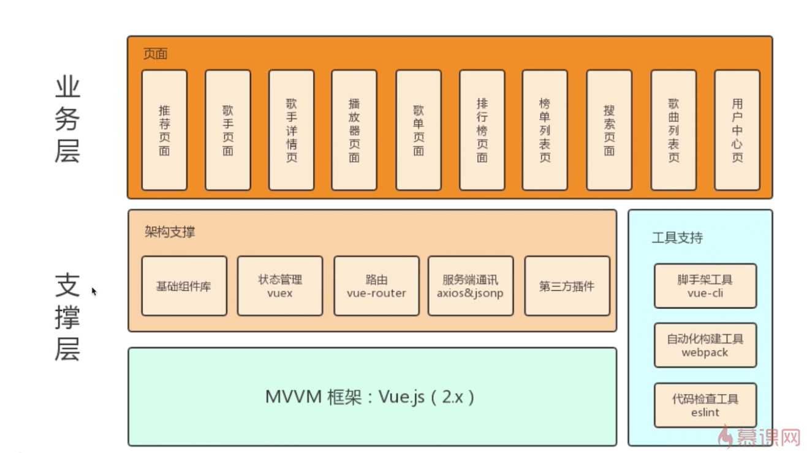
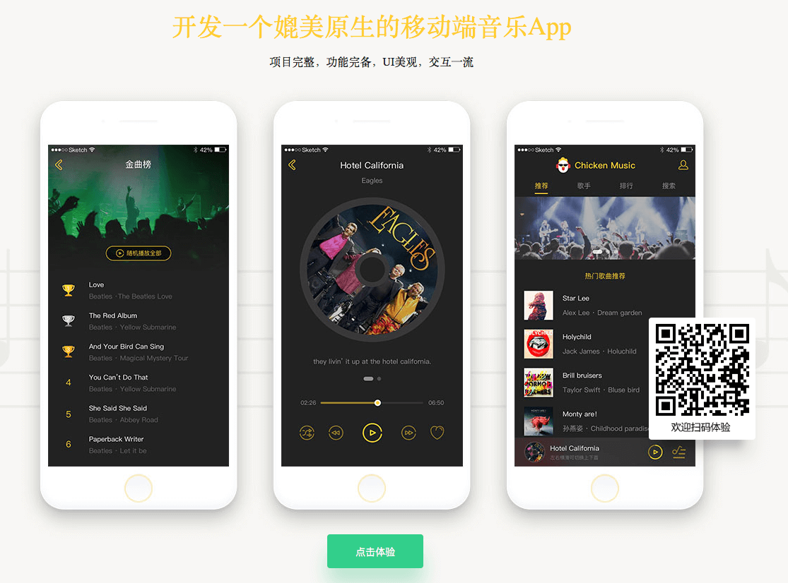

# 第1章 课程内容介绍

## 1.1 导学

### 做什么？

开发一款媲美原生移动应用体验的音乐的APP

### 业务功能

- 推荐页面
- 歌手页面
- 歌手详情页
- 播放器页
- 歌单页面
- 排行榜页面
- 榜单列表页
- 搜索页
- 歌曲列表页
- 用户中心页

### 技术栈

- Vue.js 2.0 全家桶
- 架构支撑：基础组件／vuex／vue-router／axios／jsonp／第三方插件
- 工具支持：vue-cli／webpack／eslint

### 课程安排

- CH01 课程介绍
- CH02-12 开发实战
- CH13 优化／编译打包
- CH14 回顾总结

### 重点学习

- 中等复杂度的项目开发经验
- 掌握 vue.js 的高级应用
- 组件化／模块化的开发方式
- 原生 App 体验交互的实现原理

### 目标

- 了解一个中毒复杂规模的应用开发
- 掌握 Vue.js 的高级应用
- 学会组件化、模块化的开发方式
- 了解类原生 APP 体验交互的实现原理

扫码手机端体验，[网页端体验](http://ustbhuangyi.com/music)

## 1.2 源码

[课程源码](https://github.com/ustbhuangyi/vue-music)
